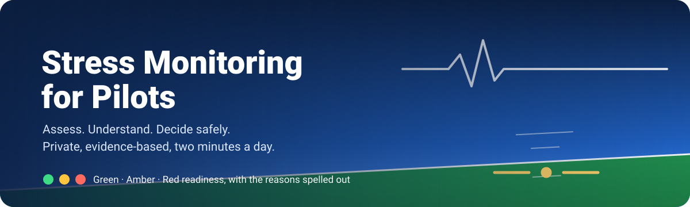
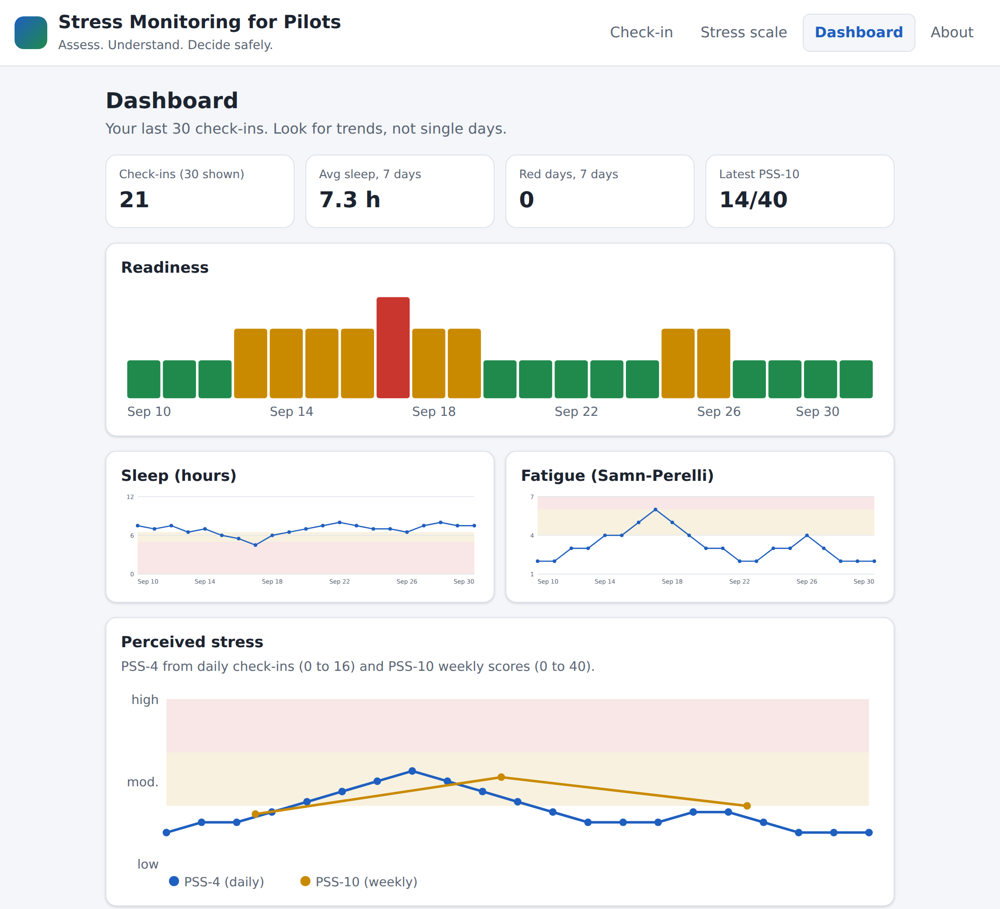
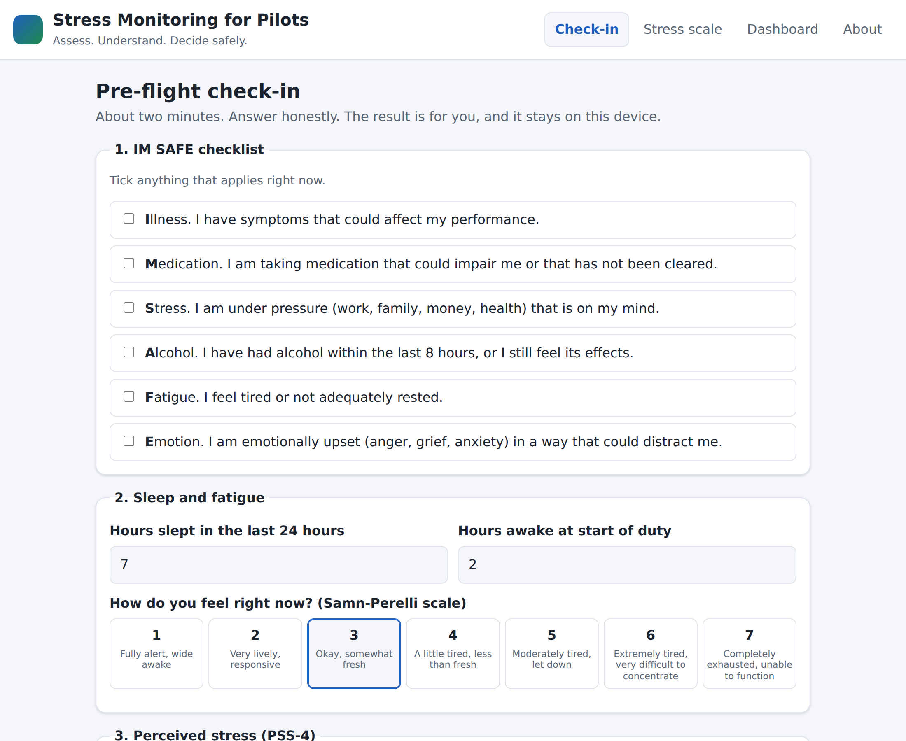
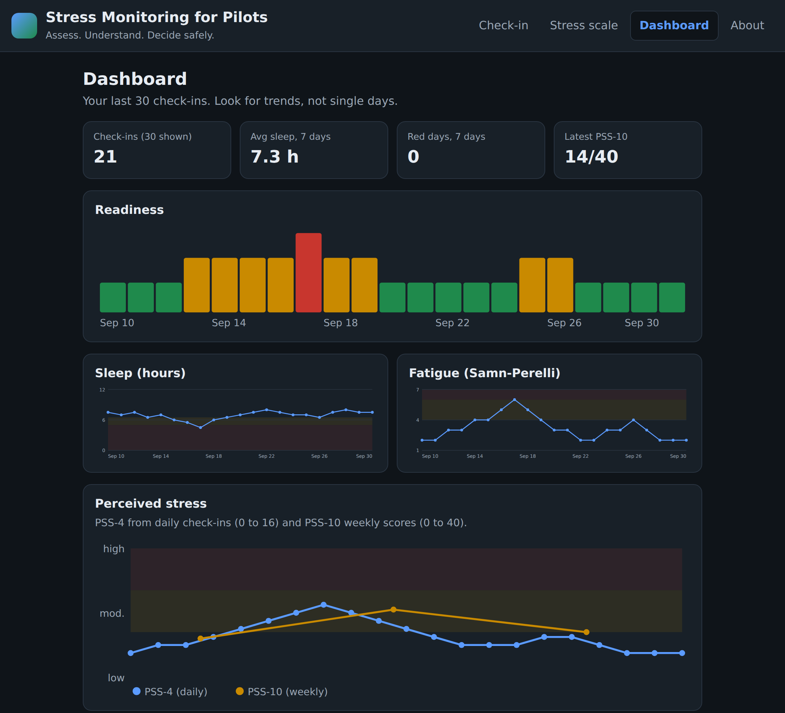
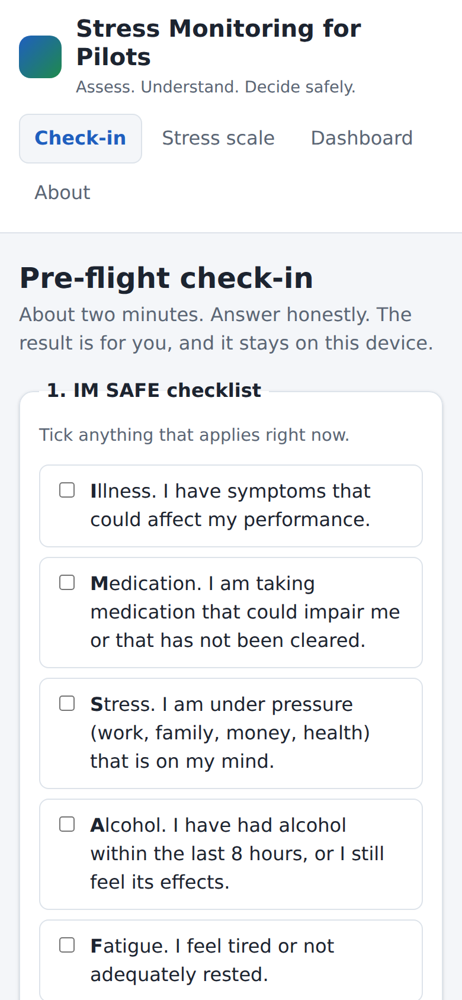
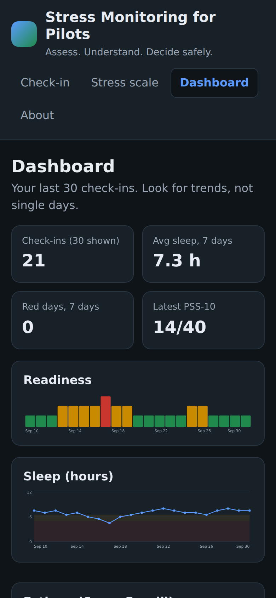

<p align="center">
  
</p>

<p align="center">
  <a href="#run-it"></a>
  <a href="#privacy"></a>
  <a href="docs/research/README.md"></a>
  <a href="LICENSE"></a>
</p>

<p align="center">
  A simple, private, evidence-based stress monitoring system that helps pilots assess and manage their mental well-being before and between flights, supporting safer flight operations.
</p>

> **Not a medical device.** This tool supports self-awareness and personal decision-making. It does not replace an aviation medical examiner, an operator's fatigue risk management system, or professional mental-health care. If you feel unsafe to fly, do not fly. If you are in crisis, contact local emergency services or a crisis line immediately.

## Screenshots

<p align="center">
  
</p>

<table>
  <tr>
    <td width="50%"></td>
    <td width="50%"></td>
  </tr>
  <tr>
    <td align="center">Pre-flight check-in</td>
    <td align="center">Dashboard, dark mode</td>
  </tr>
</table>

<p align="center">
  
  &nbsp;&nbsp;
  
</p>

## Why

Stress and fatigue narrow attention, shrink working memory, push decisions toward habit, and quieten crew communication. Regulators answer with duty limits, fatigue risk management systems and peer support programmes, all at the operator level. What a pilot lacks is a private, two-minute, daily instrument that records the IM SAFE check they already do in their head and shows the trend over weeks. That is what this is.

## What it does

| Feature | Details |
| --- | --- |
| **Pre-flight check-in** | The FAA **IM SAFE** checklist, hours slept and hours awake, the **Samn-Perelli** fatigue scale, and the 4-item Perceived Stress Scale (**PSS-4**). About two minutes. |
| **Readiness verdict** | A **Green / Amber / Red** state with every reason spelled out, using thresholds drawn from published fatigue and stress research. |
| **Weekly stress score** | The full 10-item Perceived Stress Scale (**PSS-10**) with the standard low / moderate / high bands. |
| **Trend dashboard** | Readiness bars, sleep, fatigue and stress lines with threshold bands, summary tiles and a history table. |
| **Your data, your device** | Everything stays in the browser's local storage. Export and import as JSON, delete with one click. No accounts, no server, no telemetry. |
| **Light and dark** | Follows the system colour scheme. Works at phone width. |

## Run it

No build step, no dependencies, no server. Open `app/index.html` in any modern browser, or:

```bash
git clone https://github.com/ungaaaabungaaa/Stress-Monitoring-for-Pilots.git
cd Stress-Monitoring-for-Pilots
python3 -m http.server 8000
# open http://localhost:8000/app/
```

## How the verdict works

The verdict is the worst state triggered by any rule. All triggered reasons are shown, red first.

| Input | Red | Amber |
| --- | --- | --- |
| IM SAFE: Illness, Medication, Alcohol | flagged | |
| IM SAFE: Stress, Emotion, Fatigue | | flagged |
| Sleep in last 24 h | under 5 h | 5 to 6.5 h |
| Hours awake at duty start | 17 h or more | 14 to 16.9 h |
| Samn-Perelli fatigue (1 to 7) | 6 to 7 | 4 to 5 |
| PSS-4 (0 to 16) | 12 or more | 8 to 11 |

Every threshold is traced to its source in the [system design document](docs/research/05-system-design.md). They are deliberately conservative and meant to prompt a conversation, not to make the go/no-go decision for you.

## Research

The design is grounded in published research and regulatory guidance. Start at the [research index](docs/research/README.md).

| # | Document | Covers |
| --- | --- | --- |
| 01 | [Problem statement](docs/research/01-problem-statement.md) | Why pilot stress matters, the evidence, the gap this fills |
| 02 | [Literature review](docs/research/02-literature-review.md) | Stress, fatigue and performance; sleep science; pilot mental health; HRV |
| 03 | [Assessment instruments](docs/research/03-assessment-instruments.md) | IM SAFE, Samn-Perelli, PSS-10 and PSS-4; what was rejected and why |
| 04 | [Regulatory landscape](docs/research/04-regulatory-landscape.md) | ICAO, FAA (Part 117, Pilot Fitness ARC), EASA (2018/1042, support programmes) |
| 05 | [System design](docs/research/05-system-design.md) | Architecture, data model, scoring rules with sources |
| 06 | [Ethics and privacy](docs/research/06-ethics-and-privacy.md) | Just culture, non-punitive design, medical-device boundary |
| 07 | [Roadmap](docs/research/07-roadmap.md) | PVT, personal baselines, wearables and HRV, peer-support hand-off |
| – | [References](docs/research/references.md) | Full source list |

## Privacy

All data lives in a single key in the browser's local storage. The three source files contain no network calls; you can read them in a few minutes. If a future version ever adds sharing, it will be opt-in per event, show exactly what is shared, and go to a peer support programme or the pilot's own clinician, never to line management. See [ethics and privacy](docs/research/06-ethics-and-privacy.md).

## Project layout

```
app/
  index.html          Single-page application
  style.css           Styling, light and dark
  app.js              Scoring, storage, inline-SVG charts, import/export
assets/
  banner.svg          README banner
  logo.svg            App icon
  social-preview.png  1280x640 image for the GitHub social preview
  screenshots/        Images used above
docs/research/        Research documents
```

## Contributing

Issues and pull requests are welcome, especially from pilots, aviation medical examiners, human-factors researchers and peer support volunteers. If you propose a threshold change, please cite the source.

## License

MIT. The Perceived Stress Scale is used under its free non-commercial research and educational terms; see [references](docs/research/references.md).
